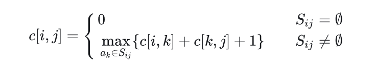
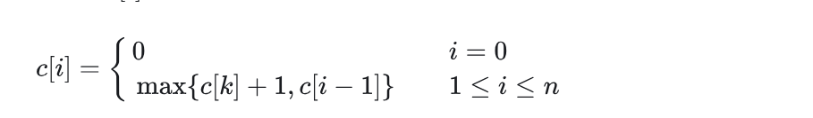
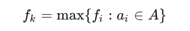

# 贪心算法

> [!note]
>
> 贪心算法(greedy algorithm)就是这样的算法，每一步都做出**当时看起来最佳的选择**。总是做出局部最优的选择
>
> 贪心方法是一种”只顾眼前”的分级处理方法：
>
> - 根据题意选取一种量度标准；
>- 按该标准一次选中一个输入；
> - 如果这个输入和当前的部分解加在一起满足约束条件，则将其加入到部分解中；否则舍弃掉。
>

> [!warning]
>
> 贪心算法并**不保证得到最优解**，但对很多问题确实可以求得最优解。
>
> 贪心法设计求解的核心问题：选择能产生问题最优解的量度标准，即**最优量度标准**


## 活动选择问题

**活动选择问题(activity-selection problem)**：是一个**调度多个活动问题**，这些活动需要互斥竞争共享资源。从一个活动日程表中选出**规模最大的相互兼容**的活动(activity)的集合。

有 n 个活动构成的集合 `S={a1,a2,…,an}` ，这些活动都需要占用会议室，且每个时刻会议室只能给一场活动提供服务。每个活动 ai 的开始时间`(start time)为 si` ，结束时间`(finish time)为 fi `，其中 `0≤si<fi<∞ `。如果活动 ai 占用的时间为左闭右开区间 [si,fi) 。如果活动 ai 和 aj 的时间区间 `[si,fi) 和 [sj,fj) 没有重叠`，那么活动 ai 和 aj 相互兼容

活动选择问题目标是从所有活动中选出一个总时间规模最大相互兼容的活动子集

> [!tip]
>
> 假设这些活动已经按照结束时间从小到大排序，即：`f1≤f2≤f3≤⋯≤fn`

### 活动选择问题的最优子结构

> [!important]
>
> 定义 Sij 为 ai 结束后 aj 开始前的活动集合，定义 Aij 为 Sij 中规模最大且相互兼容的活动子集。
>
>  Aij中包含活动 ak ，和**两个子问题 Aik 和 Akj** 。定义 `Aik=Aij∩Sik 且 Akj=Aij∩Skj `，这样有 `Aik=Aik∪{ak}∪Akj ，所以有 |Aij|=|Aik|+|Akj|+1` 。
>
> 剪切粘贴方法可以证明最优解 Aij 一定包含两个子问题 Sik 和 Skj 的最优解
>
> 如果你能找到一个由 Skj 相互兼容的活动组成的集合 Akj′ ，其中 |Akj′|>|Akj| ，那么你就可以用 Akj′ 替换 Akj 。此时就能构造出规模为|Aik|+|Akj′|+1>|Aik|+|Akj|+1=|Aij| 的相互兼容的活动集合，与 Aij 是最优解矛盾。同理也可以用于证明子问题 Sik 

- 最优解

> [!note]
>
> 定义 Sij 的最优解的规模为 c[i,j] ，运用[动态规划](https://zhida.zhihu.com/search?content_id=214481794&content_type=Article&match_order=1&q=动态规划&zhida_source=entity)方法可以写出递归式： `c[i,j]=c[i,k]+c[k,j]+1` 。
>
> 如果不知道 Sij 的最优解包含活动 ak ，就需要考察 Sij 中的所有活动，**寻找哪个活动可以构造最优解**:
>
> 

#### **方法一：动态规划（区间两个端点都不固定）**

这个方法实际意义是找到**分割点**

- 对于子问题 Sij ，当 j−i≥2 时，我们要找到活动 ak ，使得 `i<k<j,fi≤sk,fk≤sj `。
- 构造两个**虚拟活动** a0 和 an+1 ，活动 a0 的结束时间 `f0=0` ，活动 an+1 的开始时间 `sn+1=+∞` 
- 构造 Aij 规模 c[i,j] 表格 c[0:n+1,0:n+1] 和对应的 act[i,j] 选择表格 act[0:n+1,0:n+1] 。
- `c[i][j]` 表示在虚拟活动 `i` 和 `j` 之间（即活动 `i` 结束后开始、活动 `j` 开始前结束的活动）能选择的最大兼容活动数

```cpp
DP-ACTIVITY-SELECTOR(s, f, n) {
    let c[0 : n + 1, 0 : n + 1] and act[0 : n + 1, 0 : n + 1] be new tables
    //开区间，所以（i，i)和（i，i+1)之间没有活动
    for i = 0 to n
        c[i, i] = 0
        c[i, i + 1] = 1
    c[n + 1, n + 1] = 0
    //区间长度（i,i+l)中间有l-1个活动
    for l = 2 to n + 1
        //起始点
        for i = 0 to n - l + 1
            //结束点
            j = i + l
            c[i, j] = 0
            //从后往前遍历分割点
            k = j - 1
            while f[i] < f[k]
                if f[i] ≤ s[k] and f[k] ≤ s[j] and c[i, k] + c[k, j] + 1 > c[i, j]
                    c[i, j] = c[i, k] + c[k, j] + 1
                    act[i, j] = k
                k = k - 1
    print "A maximum size set of mutually compatible activities has size" c[0, n + 1]
    print "The set contains"
    PRINT-ACTIVITIES(c, act, 0, n + 1)
}

PRINT-ACTIVITIES(c, act, i, j)
    if c[i, j] > 0
        k = act[i, j]
        print k
        PRINT-ACTIVITIES(c, act, i, k)
        PRINT-ACTIVITIES(c, act, k, j)
```

- DP-ACTIVITY-SELECTOR的运行时间为 O(n^3) 。

#### **方法二：动态规划（区间一个端点固定，另一个端点不固定）**

这个方法则是从左到右判断是否**选择该活动**

假定所有活动已经按照结束时间从小到大排序。

只需要从单端开始拓展就行，构造数组 c[0,n] ，构造一个虚拟活动 a0 ，活动 a0 的结束时间 ，`f0=0，v0=0` ，**c[i] 表示前 i 个活动能够取得的最大规模**，即子问题 S0,i 中规模最大且相互兼容的活动子集 A0,i 的规模，对应的活动序列为 act[i] 。则求解 c[i] 的递归式如下：



当 i≠0 时， c[i] 在**选择第 i 个活动 c[k]+1** （ k 为结束时间小于等于且最接近 si 的活动下标）和**不选择第 i 个活动 c[i−1]** 之间取最大值

DP-ACTIVITY-SELECTOR伪代码如下：

```cpp
-ACTIVITY-SELECTOR(s, f, v, n)
    let c[0 : n] and act[0 : n] be new arrays
    c[0] = 0
    for i = 1 to n
        k = i - 1
        //找到不冲突的活动
        while k > 0
            if f[k] ≤ s[i]
                break
            k = k - 1
        if c[k] + 1 > c[i - 1]
            c[i] = c[k] + 1
            act[i] = act[k]
            act[i] = act[i] ∪ {i} 
        else 
            c[i] = c[i - 1]
            act[i] = act[i - 1]
    print "A maximum size set of mutually compatible activities has size" c[n]
    print "The set contains"
    print act[n]
```

DP-ACTIVITY-SELECTOR的运行时间为 O(n^2) 。

#### **方法三：动态规划（区间一个端点固定，另一个端点不固定）二分查找优化**

方法二中查找 k 的步骤因为**f[n]是有序的**，可以用**二分查找进一步优化**：

```cpp
DP-ACTIVITY-SELECTOR(s, f, v, n)
    let c[0 : n] and act[0 : n] be new arrays
    c[0] = 0
    for i = 1 to n
        l = 1
        r = i
        while l ≤ r
            mid = ⌊(l + r) / 2⌋ 
            if f[mid] ≤ s[i]
                l = mid + 1
            else
                r = mid - 1
        k = r
        if c[k] + 1 > c[i - 1]
            c[i] = c[k] + 1
            act[i] = act[k]
            act[i] = act[i] ∪ {i}
        else 
            c[i] = c[i - 1]
            act[i] = act[i - 1]
    print "A maximum size set of mutually compatible activities has size" c[n]
    print "The set contains"
    print act[n]
```

DP-ACTIVITY-SELECTOR的运行时间为 O(nlg⁡n) 。

> [!tip]
>
> 全源最短路径[Floyd算法](https://zhida.zhihu.com/search?content_id=214481794&content_type=Article&match_order=1&q=Floyd算法&zhida_source=entity)、单源最短路径[Dijkstra算法](https://zhida.zhihu.com/search?content_id=214481794&content_type=Article&match_order=1&q=Dijkstra算法&zhida_source=entity)、单源最短路径**Dijkstra算法优先队列优化**的运行时间依次为 O(n3) 、 O(n2) 、 O(nlg⁡n) 。
>
> 两者非常相似。

### 贪心选择（最早结束）

对于活动选择问题，我们只需要考虑一个选择，那就是贪心选择。

贪心选择一个能够**尽早结束活动**，这样留下尽可能多的资源供接下来的活动使用。

由于所有活动已经按照结束时间从小到大排序，贪心选择 a1 ，接下来只有一个子问题要处理，**选择一个在 a1 结束后开始的活动**。为什么没必要考察在 a1 开始前的活动呢？因为 s1<f1 ， f1 是最早结束的活动，所以**不会有活动结束时间早于 s1** ，可以贪心选择活动 a1 

令 `Sk={ai∈S:si≥fk}` 为在 **ak 结束后开始**的任务集合。当贪心选择 a1 后， S1 是唯一需要求解的子问题。

#### **定理16.1(Theorem 16.1)**

> [!note]
>
> 考虑任意非空子问题Sk, 令am 是Sk 中结束时间最早的活动，则 am 在sk 的某个 最大兼容活动子集中。
>
> 证明：定义 Ak 是 Sk 的最大兼容活动子集，且 aj 是 Ak 中结束时间最早的活动。
>
> 1. 若 aj=am ，则已证明 am∈Ak 。
> 2. 若 aj≠am ，令 `Ak′=(Ak−{aj})∪{am} `，则 |Ak|=|Ak′| 。又 aj 是 Ak 中结束时间最早的活动，am 是 Ak′ 中结束时间最早的活动， fm≤fj 。所以 Ak′ 是 Sk 的最大兼容活动子集， am∈Ak′ 。

我们每次选择**结束时间最早的且与当前活动兼容**的活动，重复执行这个过程直到没有剩余活动可以选择。所选择的活动的结束时间必然是严格递增的。所以我们只需要按照结束时间单调递增的顺序处理所有活动，每个活动仅需要考察一次。

由于[贪心算法](https://zhida.zhihu.com/search?content_id=214481794&content_type=Article&match_order=1&q=贪心算法&zhida_source=entity)只有一个子问题，所以用自顶向下的方法进行求解也非常方便。

#### 递归贪心算法(A recursive greedy algorithm)

可以增加一个**虚拟活动 a0** 放在所有活动之前，其结束时间 f0=0 。这样子问题 S0 就是完整的活动集合 S 。RECURSIVE-ACTIVITY-SELECTOR的伪代码如下：

```c
RECURSIVE-ACTIVITY-SELECTOR(s, f, k, n) 
    m = k + 1
    while m ≤ n and s[m] < f[k]    // find the first activity in S_k to finish
        m = m + 1
    if m ≤ n
        return {a_m} ∪ RECURSIVE-ACTIVITY-SELECTOR(s, f, m, n) 
    else return ∅

RECURSIVE-ACTIVITY-SELECTOR(s, f, 0, n) // call function
```

假定所有活动**已经按照结束时间从小到大排序**，则递归调用 RECURSIVE-ACTIVITY-SELECTOR(s,f,0,n) 的运行时间为 Θ(n) 。

#### 迭代贪心算法(An iterative greedy algorithm)

RECURSIVE-ACTIVITY-SELECTOR几乎就是**[尾递归](https://zhida.zhihu.com/search?content_id=214481794&content_type=Article&match_order=1&q=尾递归&zhida_source=entity)(tail recursive)**，

> 如果一个函数中所有递归形式的调用都出现在函数的末尾，我们称这个递归函数是尾递归的。（详见思考题7-5）

将尾部递归过程转换为迭代形式通常是一项简单的任务。事实上，**某些编程语言的编译器会自动执行此任务。**

RECURSIVE-ACTIVITY-SELECTOR可以转化为迭代版本GREEDY-ACTIVITY-SELECTOR，伪代码如下：

```cpp
GREEDY-ACTIVITY-SELECTOR(s, f, n)
    A = {a_1}
    k = 1
    for m = 2 to n
        if s[m] ≥ f[k]    // is a_m in S_k
            A = A ∪ {a_m}    // yes, so choose it
            k = m    // and continue from there
    return A
```

变量 k 记录了**最近加入集合 A 的活动下标**，对应递归算法中的活动 ak ，由于我们按照结束时间单调递增处理活动。 fk 是 A 中活动的的最大结束时间，也就是说，



假定所有活动已经按照结束时间从小到大排序，则递归调用 GREEDY-ACTIVITY-SELECTOR(s,f,n) 的运行时间为 Θ(n) 。

### 另一贪心选择（最晚开始）

不再一直选择最早结束的活动，而是**选择最晚开始**的活动，前提仍然是与之前 选出的所有活动均兼容

这个策略和选择最早结束的方案是完全对称的，假设时间倒流，所有活动倒过来执行。

有 n 个活动构成的集合 `S={a1,a2,…,an}` ，假设这些活动已经按照**开始时间从大到小**排序，即：` s1≥s2≥s3≥⋯≥sn `。

> [!tip]
>
> 令 `Sk={ai∈S:fk≤si}` 为在 ak **开始前结束**的任务集合。当贪心选择 a1 后， S1 是唯一需要求解的子问题。
>
> 考虑任意非空子问题 Sk ，如果 am 是 Sk 中开始时间最晚的活动，那么 am 在 Sk 的某个最大兼容活动子集中。
>
> 证明：定义 Ak 是 Sk 的最大兼容活动子集，且 aj 是 Ak 中开始时间最晚的活动。
>
> 1. 若 aj=am ，则已证明 am∈Ak 。
> 2. 若 aj≠am ，令 `Ak′=(Ak−{aj})∪{am} `，则 |Ak|=|Ak′| 。又 aj 是 Ak 中开始时间最晚的活动，am 是 Ak′ 中开始时间最晚的活动， sm≥sj 。所以 Ak′ 是 Sk 的最大兼容活动子集， am∈Ak′ 。

我们每次选择开始时间最晚的且与当前活动兼容的活动，重复执行这个过程直到没有剩余活动可以选择。所选择的活动的开始时间必然是严格递减的。所以我们只需要按照开始时间单调递减的顺序处理所有活动，每个活动仅需要考察一次

#### **递归贪心算法**

可以增加一个**虚拟活动 a0** 放在所有活动之后，其开始时间 s0=f1 。这样子问题 S0 就是完整的活动集合 S 。RECURSIVE-ACTIVITY-SELECTOR的伪代码如下：

```cpp
RECURSIVE-ACTIVITY-SELECTOR(s, f, k, n) 
    m = k + 1
    //越往后开始时间越早，f[m]>s[k]则保证兼容
    while m ≤ n and f[m] > s[k]    // find the first activity in S_k to start
        m = m + 1
    if m ≤ n
        return {a_m} ∪ RECURSIVE-ACTIVITY-SELECTOR(s, f, m, n) 
    else return ∅

RECURSIVE-ACTIVITY-SELECTOR(s, f, 0, n) // call function
```

假定所有活动已经按照开始时间排好序，则递归调用 

RECURSIVE-ACTIVITY-SELECTOR(s,f,0,n) 的运行时间为 Θ(n) 。

#### **迭代贪心算法**

迭代版本GREEDY-ACTIVITY-SELECTOR，伪代码如下：

```cpp
GREEDY-ACTIVITY-SELECTOR(s, f, n)
    A = {a_1}
    k = 1
    for m = 2 to n
        if f[m] ≤ s[k]    // is a_m in S_k
            A = A ∪ {a_m}    // yes, so choose it
            k = m    // and continue from there
    return A
```

假定所有活动已经按照开始时间排好序，则调用 GREEDY-ACTIVITY-SELECTOR(s,f,n) 的运行时间为 Θ(n) 。

### 不合理的贪心选择

在剩余活动中选择**持续时间最短**的活动不能得到最大兼容的活动子集。

在剩余活动中选择**与其它活动重叠最少**的活动不能得到最大兼容的活动子集。

在剩余活动中**选择最早开始**的活动不能得到最大兼容的活动子集。


## 区间着色问题

假设有一组活动，将它们安排到一些讲堂，任意活动都可以在任意讲堂进行，我们希望用**最少的教室完成所有活动**，设计一个贪心算法求每个活动所在讲堂进行分配。

> [!note]
>
> 这个问题可以视为**区间图着色问题(interval-graph coloring problem)**。区间图着色问题：构造一个区间图，顶点表示给定的活动，边连接不兼容的活动。要求用最少的颜色对顶点进行着色，相邻顶点的颜色不能相同。

- 设活动数组为 A ，总共有 n 个活动。每个活动保存为一个结构体，包含活动id，开始时间，结束时间，讲堂id。

### **方法一：优先队列**

朴素思想：每当有新活动时，就遍历所有讲堂，查看是否有空闲讲堂。如果没有空闲讲堂，就新开一个讲堂。为了方便**选出空闲讲堂**，我们可以使用优先队列。

> 1. 按照**开始时间**对活动进行排序。
> 2. 初始化一个**小顶堆**，按照**结束时间排序**，堆顶活动为最早结束的活动。
> 3. 遍历检查每一个活动
>    1. 如果**堆为空**，增加一个新讲堂，选好讲堂后将**活动加入堆中**，同时将该活动记录到所在讲堂举行的活动名单中。
>    2. 如果**堆不为空**，和堆顶活动进行比较，如果堆顶活动的结束时间小于或等于当前活动的开始时间即检查当前有无空闲讲堂，将堆顶活动出队，并将当前活动放在堆顶活动所在讲堂进行，否则开辟一个新讲堂。选好讲堂后将活动加入堆中，同时将该活动记录到所在讲堂举行的活动名单中
> 4. 所有活动检查结束后，输出所有讲堂举行的活动名单。

```cpp
LECTURE-HALLS-SCHEDULE(A, n) 
    sort A by start time in ascending order
    //A[i]={start_time,finsh_time,hall-id，activity_id}
    let PQ be a new min-priority queue keyed by end time
    let H be a new table
    hall-count = 0
    //遍历活动
    for i = 1 to n
        if PQ.empty() == true
            hall-count = hall-count + 1
            A[i].hall-id = hall-count 
            PQ.push(A[i])
            H[hall-count] = H[hall-count] ∪ {A[i]}
        else 
            //有空闲讲堂
            if A[i].start-time ≥ PQ.top().end-time
                A[i].hall-id = PQ.top().hall-id
                H[A[i].hall-id] = H[A[i].hall-id] ∪ {A[i]}
                PQ.pop()
            else
                hall-count = hall-count + 1
                A[i].hall-id = hall-count
                let h be a new array
                H.push_back(h)
                H[A[i].hall-id] = H[A[i].hall-id] ∪ {A[i]}
            PQ.push(A[i])
    for j = 1 to hall-count
        print "the activities lecture hall" j "will hold are: "
        for k = 1 to H[j].size()
            print H[j][k].activity-id ", "
```

LECTURE-HALLS-SCHEDULE运行时间为 **Θ(nlg⁡n)** ，排序运行时间为 Θ(nlg⁡n) ，每个活动要检查一次，优先队列调整运行时间为 O(lg⁡n) ，总共有 n 个活动，总计 O(nlg⁡n) 。所以总的运行时间为 Θ(nlg⁡n) 。

LECTURE-HALLS-SCHEDULE需要的辅助空间大小为 **Θ(n)** ，最坏情况下所有活动都需要一个独立的讲堂，优先队列最大为 O(n) ，表格 H 记录所有活动，大小为 Θ(n) 。所以总的辅助空间大小为 Θ(n) 。

### 方法二：有序化

1. 将活动数组分别按照开始时间和结束时间从小到大排序。按照开始时间从小到大排序的数组称为活动开始数组，按照结束时间从小到大排序的数组称为活动结束数组，
2. 维护两个指针，活动开始数组指针 sp ，跟踪活动开始，活动结束数组 fp ，跟踪活动结束。
3. 当考虑 sp 指向的特定活动时，**检查该开始时间是否大于或等于 fp 指向的活动**。若如此，则说明 fp 开始时，已经有活动结束。于是我们可以重用讲堂。否则，我们就需要开新讲堂，同时**记录新开讲堂**。处理结束后自增 sp ，处理下一个活动。
4. **若有活动结束，则记录空闲讲堂**（可以用栈或者队列维护所有空闲讲堂），自增 fp 
5. 重复这一过程，直到 sp 处理完所有活动。

```cpp
LECTURE-HALLS-SCHEDULE(A, n) 
    sort A by start time in ascending order
    A' = A
    sort A' by start time in ascending order
    let H be a new table
    hall-count = 0
    sp = 1
    fp = 1
    let Q be a new queue
    while sp ≤ n
        //有空闲讲堂或者说有活动结束
        if A[sp].start-time ≥ A'[fp].finish-time
            hall-id = Q.pop()
            A[sp].hall-id = hall-id
            H[hall-id] = H[hall-id] ∪ {A[sp]}
            Q.push(A'[fp].hall-id) //放入当前活动
            fp = fp + 1
        else
            hall-count = hall-count + 1
            A[sp].hall-id = hall-count
            let h be a new array
            H.push_back(h)
            H[A[sp].hall-id] = H[A[sp].hall-id] ∪ {A[sp]}
        sp = sp + 1
    for j = 1 to hall-count
        print "the activities lecture hall" j "will hold are: "
        for k = 1 to H[j].size()
            print H[j][k].activity-id ", "
```

LECTURE-HALLS-SCHEDULE运行时间为 **Θ(nlg⁡n)** ，排序运行时间为 Θ(nlg⁡n) ，每个活动要检查一次，运行时间为 Θ(1) ，总共有 n 个活动，总计 Θ(n) 。所以总的运行时间为 Θ(nlg⁡n) 。

LECTURE-HALLS-SCHEDULE需要的辅助空间大小为 Θ(n) ，复制数组 A′ 记录所有活动大小为 Θ(n) ，辅助队列 Q 大小为 O(n) ，表格 H 记录所有活动，大小为 Θ(n) 。所以总的辅助空间大小为 Θ(n) 。